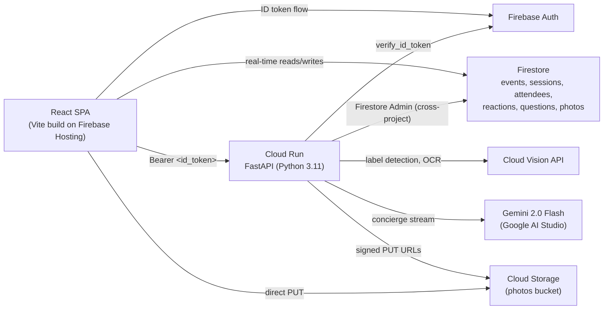
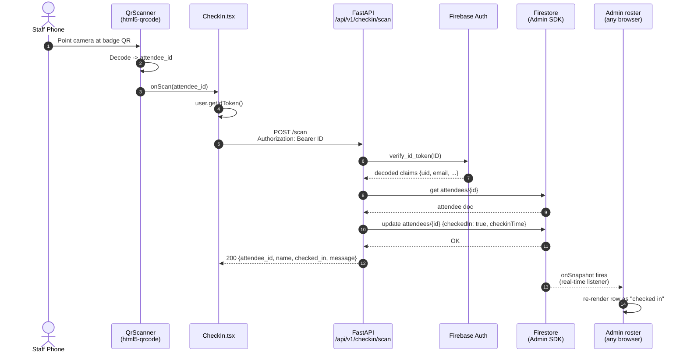
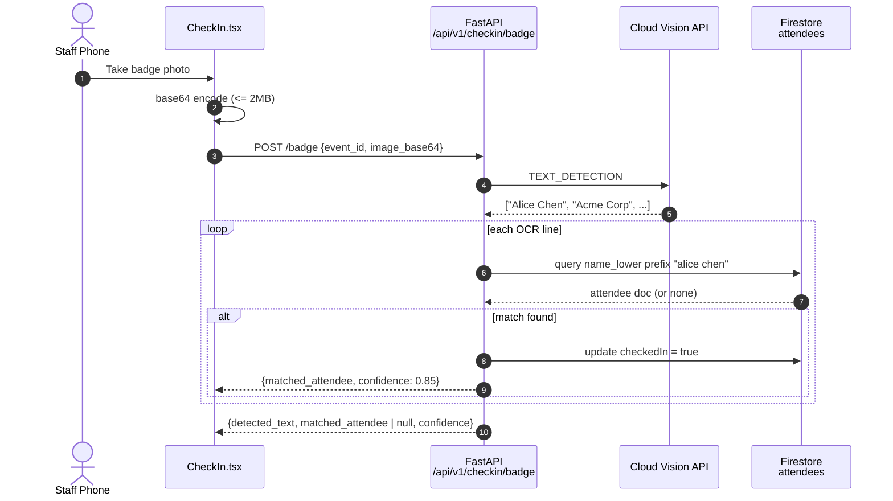
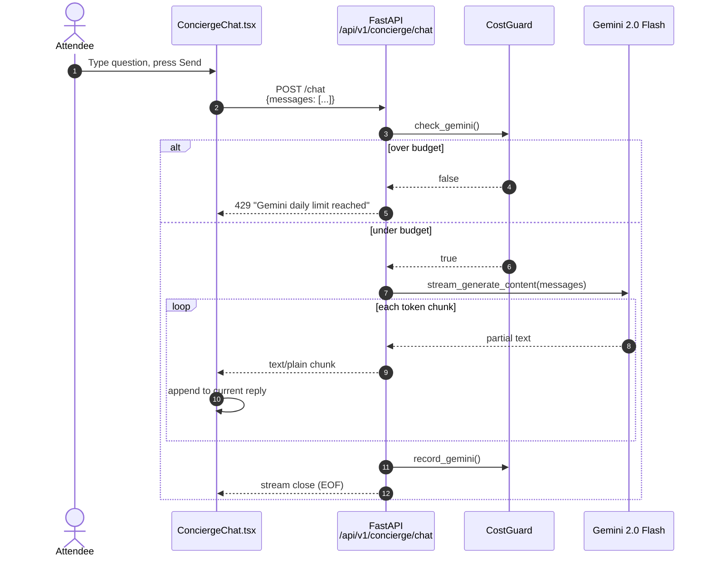
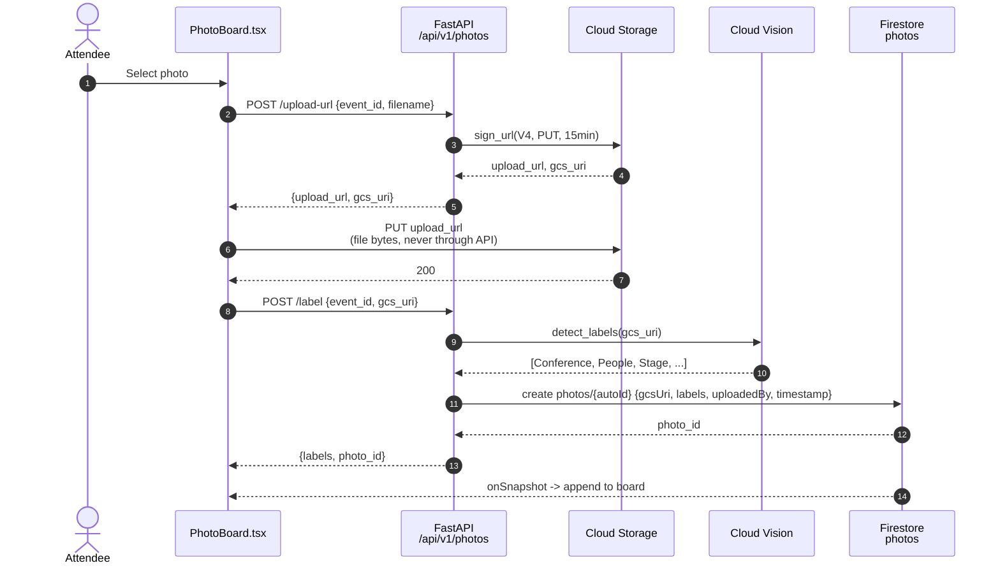
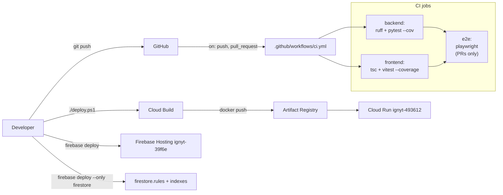

# Architecture

This document explains how the Ignyt system fits together: what each
component owns, how requests flow through the stack, and why certain
tradeoffs were made. For a quick product overview see
[`../README.md`](../README.md); for the API contract see
[`API.md`](./API.md); for testing see [`TESTING.md`](./TESTING.md).

## System at a glance



### Why two projects?

Ignyt deploys across **two GCP projects** by convention:

| Project | Purpose | Examples |
|---|---|---|
| `ignyt-39f6e` (Firebase) | Identity, Firestore, Hosting, Storage | Firebase Auth, Firestore DB, photos bucket |
| `ignyt-493612` (Cloud Run) | Compute | FastAPI container, Artifact Registry, Cloud Build, Secret Manager |

**Rationale.** Firebase projects carry opinionated defaults (Hosting
region, Firestore location, Auth config) that tie them to a specific
identity surface. Keeping the compute project separate lets us swap the
runtime (Cloud Run → GKE → whatever) without migrating user data or
re-signing auth tokens.

IAM bindings in `bootstrap.ps1` grant the Cloud Run runtime service
account `roles/datastore.user` and `roles/firebaseauth.viewer` on
`ignyt-39f6e` so cross-project calls work without delegation trickery.

---

## Component inventory

### Frontend (`frontend/`)

| Module | Responsibility |
|---|---|
| `src/App.tsx` | Top-level router + auth gate |
| `src/pages/EventPage.tsx` | Attendee-facing feed (reactions, Q&A, photos, concierge) |
| `src/pages/Admin.tsx` | Organizer view: roster, per-attendee QR, re-seed |
| `src/components/features/` | Self-contained feature widgets (CheckIn, ConciergeChat, EngagementWall, PhotoBoard, QrScanner) |
| `src/components/ui/` | Cross-cutting primitives (Icons, ErrorBoundary) |
| `src/hooks/useAuth.ts` | Firebase Auth bindings — state machine + sign-in flows |
| `src/hooks/useFirestore.ts` | Real-time collection subscription + demo seeding |
| `src/lib/api.ts` | `fetch`-based REST client with Bearer token injection |
| `src/lib/firebase.ts` | Firebase SDK initialization (reads `VITE_FIREBASE_*`) |
| `src/lib/demoData.ts` | The 15-attendee demo roster |
| `src/lib/constants.ts` | `DEMO_EVENT_ID` — mirrored in `firestore.rules` |

**State model.** No Redux / Zustand. We lean on:
- **Firestore real-time listeners** (`useCollection`) for anything
  collaborative (roster, reactions, Q&A).
- **React Query** is installed but not yet in use — slated for the
  concierge/photo side to get caching + retries.
- **Firebase Auth's `onAuthStateChanged`** for the auth state machine.

### Backend (`backend/`)

| Module | Responsibility |
|---|---|
| `app/main.py` | FastAPI app factory, CORS, lifespan, OpenAPI metadata |
| `app/api/v1/router.py` | Mounts all v1 routers and the `/budget` endpoint |
| `app/api/v1/checkin.py` | `POST /scan` (QR) + `POST /badge` (Vision OCR) |
| `app/api/v1/photos.py` | `POST /upload-url` (signed GCS URL) + `POST /label` (Vision labels) |
| `app/api/v1/concierge.py` | `POST /chat` (Gemini streaming) |
| `app/core/config.py` | `pydantic-settings` Settings — env-driven config |
| `app/core/security.py` | Firebase Admin SDK + `get_current_user` dependency |
| `app/core/budget.py` | `CostGuard` — per-instance daily counters |
| `app/core/dependencies.py` | `get_firestore` — cached `AsyncClient` |
| `app/services/gemini.py` | Gemini client wrapper, streaming adapter |
| `app/services/vision.py` | Cloud Vision client wrapper (labels + OCR) |
| `app/services/storage.py` | GCS signed URL generator |
| `app/repositories/attendee_repo.py` | Firestore attendee data access (CRUD + `name_lower` search) |

**Layering.** A strict **routes → services → repositories** split.
Business logic lives in services/repos; routes stay thin so they stay
testable. Dependencies are injected via FastAPI's `Depends(...)` so tests
can swap mocks without patching module globals (see
`backend/tests/conftest.py`).

### Data (Firestore)

```
events/{eventId}
├─ name, description, date, location
├─ attendees/{attendeeId}
│    ├─ name, name_lower, email, interests, checkedIn
│    └─ (checkinTime, photoUrl — optional)
├─ sessions/{sessionId}
│    └─ title, speaker, time, room
├─ reactions/{autoId}
│    └─ emoji, userId, timestamp
├─ questions/{autoId}
│    └─ text, userId, userName, upvotes, timestamp
└─ photos/{autoId}
     └─ gcsUri, labels, uploadedBy, timestamp
```

Indexes live in `firestore.indexes.json`. Today there's exactly one
composite index (`questions` ordered by `upvotes DESC, timestamp DESC`)
— everything else uses Firestore's default single-field indexes.

---

## Request flow: attendee QR check-in

The hot path we optimize for — sub-second response from tap to UI update.



**Key property:** the admin roster updates **without polling** because it
subscribes to the Firestore collection via `useCollection`. The backend
only writes; the UI reads the change through Firestore's real-time fanout.

### Error paths

| Where | What fails | Result |
|---|---|---|
| `verify_id_token` | Expired or forged token | 401 Unauthorized |
| `get attendees/{id}` | Attendee missing | 404 Not Found |
| Firestore rules | Non-organizer writing non-demo event | 403 at rule layer |

---

## Request flow: badge OCR fallback

When a staff member can't scan the QR (damaged badge, wrong angle), they
snap a photo and hit the `/badge` endpoint.



**Why `name_lower`?** Firestore is case-sensitive for range queries.
Storing a pre-lowercased copy lets us do `where name_lower >= q AND
name_lower < q + '\uffff'` — a cheap prefix index scan instead of pulling
the full collection. `DEMO_ATTENDEES` and `seedDemoData()` both maintain
this invariant; a test in `demoData.test.ts` locks it in.

---

## Request flow: concierge chat (streaming)



**Why not SSE?** FastAPI's `StreamingResponse` with `text/plain` is
sufficient — the browser's `ReadableStream` API reads chunks just fine.
SSE adds event framing overhead we don't need. See
`frontend/src/lib/api.ts::apiStreamPost` for the client half.

---

## Request flow: photo upload + labeling

Two-phase to keep bytes out of the API layer. Uploads go **directly to
GCS** via a V4 signed URL; the API only stores metadata.



---

## Security

### Defense in depth

| Layer | Mechanism |
|---|---|
| Network | Cloud Run HTTPS only; CORS locked to Firebase Hosting origin |
| Authentication | Firebase ID token (JWT, 1h TTL), verified server-side |
| Authorization (backend) | `get_current_user` dependency on all `/api/v1/*` routes |
| Authorization (Firestore) | `firestore.rules` — `isOrganizer()` / `isDemoEvent()` / `isOwner()` |
| Secrets | Gemini API key in Secret Manager, mounted as env at container start |
| Cost | `CostGuard` daily caps + GCP billing budget alert at $3 |

### Firestore rules overview

The rules file is the source of truth for client-side write authority.
Key helpers:

```js
function isSignedIn()      { return request.auth != null; }
function isOwner(uid)      { return isSignedIn() && request.auth.uid == uid; }
function isOrganizer()     { return isSignedIn() && request.auth.token.role == 'organizer'; }
function isDemoEvent(id)   { return id == 'demo-event'; }
```

Writes to `events/{eventId}/**` require `isOrganizer() ||
(isSignedIn() && isDemoEvent(eventId))`. This mirrors the
`DEMO_EVENT_ID` constant in the frontend — drift between the two breaks
the seed demo path. A test in
`frontend/src/lib/__tests__/constants.test.ts` locks the value to
`"demo-event"` and a rules test (Phase 7) will lock the rules side.

---

## Cost controls

### Where the $3/day cap comes from

| Service | Configuration | Rationale |
|---|---|---|
| Cloud Run | `min-instances=0`, `max-instances=2`, CPU-throttled | Idle = free; burst cap limits runaway |
| Cloud Build | Default quota (free tier) | One build per deploy |
| Gemini 2.0 Flash | Free via AI Studio + `CostGuard` daily cap | Free tier generous but rate-limited |
| Vision API | First 1000 calls/month free + `CostGuard` daily cap | Usage caps enforced twice |
| Firestore | Free tier (50k reads, 20k writes/day) | Hackathon-scale demo stays inside it |
| Cloud Storage | Free tier (5GB) + 30-day photo lifecycle | Old photos auto-delete |
| Firebase Hosting | Free tier | No cost under reasonable traffic |
| Billing alert | $2 warning, $3 hard-stop budget | Last line of defense |

### CostGuard tradeoffs

Read [`API.md#cost-guard`](./API.md#cost-guard) for the full story. In
short: it's a **per-instance** counter, so with `max-instances=2` real
usage can double the `*_limit` values. Fine for a hackathon demo, not
fine for production — the upgrade path is Redis counters.

---

## Local development

```
┌───────────────────┐   http://localhost:5173
│ Vite dev server   │────────────────────────────▶ Browser
│ (frontend)        │
│                   │   /api/* proxy
│                   │─────────┐
└───────────────────┘         │
                              ▼
┌───────────────────┐   http://localhost:8080
│ uvicorn           │
│ (backend)         │   Application Default Credentials
│ app.main:app      │─────────▶ real Firestore / Gemini / Vision
└───────────────────┘              in ignyt-39f6e / 493612
```

**Firebase emulator is NOT wired up yet.** Local dev hits real cloud
resources against `demo-event`, so make sure you `gcloud auth
application-default login` before starting the backend. Phase 7 adds
the emulator for rules testing.

---

## CI/CD



See [`TESTING.md`](./TESTING.md) for test execution details and
[`../README.md`](../README.md#deploy) for the deploy flow.

---

## Open questions / future work

- **Firestore emulator for E2E.** Current E2E hits real cloud — fine for
  staging but slow/flaky. Phase 7 may swap to the emulator.
- **Redis-backed CostGuard.** Move counters out of process memory so
  `max-instances` doesn't multiply budget.
- **Streaming API v2.** If we ever need binary bidirectional streams,
  switch to gRPC-Web or WebSocket; plain `text/plain` streaming is fine
  for the current concierge use case.
- **Multi-tenant event model.** The `DEMO_EVENT_ID` single-tenant
  shortcut exists throughout the frontend. Multi-tenant would mean a
  route param (`/events/:eventId/...`) and dropping the `isDemoEvent()`
  escape hatch from rules.
- **React Query adoption.** `@tanstack/react-query` is installed but
  unused — migrating the concierge/photos endpoints would simplify
  loading/error states.
